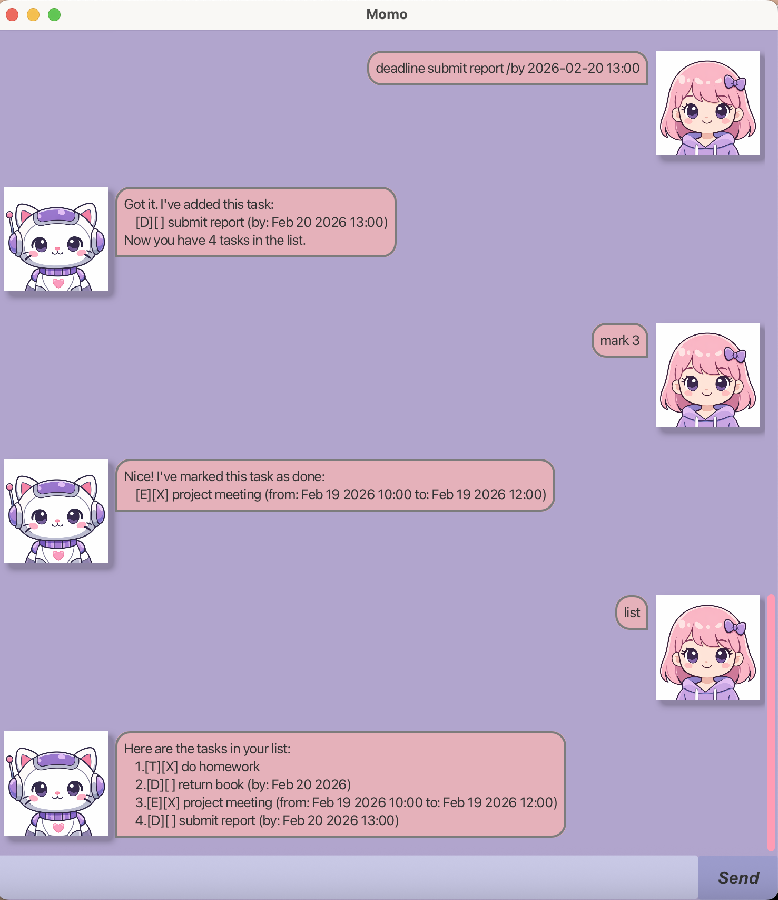

# Momo User Guide

Momo is a desktop task manager for users who prefer typing commands.
It allows you to manage todos, deadlines, and events efficiently through a command-based interface.

---

## Quick Start

1. Ensure you have Java 17 or above installed.
2. Download the latest `momo.jar`.
3. Open a terminal and navigate to the folder containing the jar file.
4. Run `java -jar momo.jar`.
5. The GUI should appear as shown below:

   

6. Type commands into the input box and press Enter or click the "Send" button.

---

## Features

### Adding a Todo

Adds a task without date or time.

Format:
```
todo DESCRIPTION
```

Example:
```
todo read book
```

---

### Adding a Deadline

Adds a task with a due date.  
The deadline can be specified with date only, or with date and time.

Format (date only):
```
deadline DESCRIPTION /by yyyy-mm-dd
```

Format (date and time):
```
deadline DESCRIPTION /by yyyy-mm-dd HH:mm
```

Date format must follow ISO format (e.g., 2026-02-15).
Time format uses 24-hour format (e.g., 14:00).

Examples:
```
deadline return book /by 2026-02-15
deadline submit report /by 2026-02-15 23:59
```

---

### Adding an Event

Adds a task with a start and end date/time.

Format:
```
event DESCRIPTION /from yyyy-mm-dd HH:mm /to yyyy-mm-dd HH:mm
```

Time format uses 24-hour format (e.g., 14:00).

Example:
```
event project meeting /from 2026-02-15 14:00 /to 2026-02-15 16:00
```

---

### Listing Tasks

Displays all tasks.

Format:
```
list
```

---

### Marking a Task

Marks a task as done.

Format:
```
mark INDEX
```

---

### Unmarking a Task

Marks a task as not done.

Format:
```
unmark INDEX
```

---

### Deleting a Task

Deletes a task.

Format:
```
delete INDEX
```

---

### Finding Tasks

Finds tasks containing a keyword.

Format:
```
find KEYWORD
```

Example:
```
find book
```

---

### Tagging a Task

Adds one or more tags to an existing task.  
You can specify multiple tags in a single command.

Format:
```
tag INDEX #TAG_NAME [#TAG_NAME]...
```

Examples:
```
tag 2 #urgent
tag 2 #urgent #school
```

---

### Removing a Tag

Removes one or more tags from an existing task.  
You can specify multiple tags in a single command.

Format:
```
untag INDEX #TAG_NAME [#TAG_NAME]...
```

Example:
```
untag 2 #urgent
untag 2 #urgent #school
```

---

### Filtering by Tag

Displays tasks that contain the specified tag.
The tag must start with `#`.

Format:
```
filter #TAG_NAME
```

Example:
```
filter #urgent
```

### Exiting the Application

Format:
```
bye
```

---

## Saving Data

Tasks are saved automatically to a local file and loaded when the application starts.
